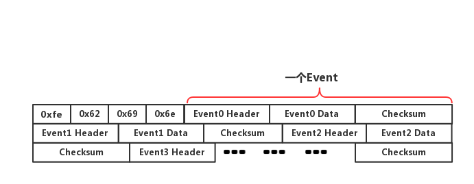
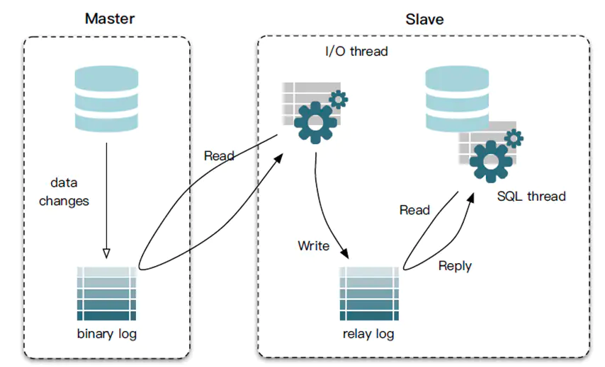

[TOC]

# binlog

## 定义

binlog是记录所有数据库表结构变更（例如CREATE、ALTER TABLE…）以及表数据修改（INSERT、UPDATE、DELETE…）的二进制日志。

binlog不会记录SELECT和SHOW这类操作，因为这类操作对数据本身并没有修改，但你可以通过查询通用日志来查看MySQL执行过的所有语句。但如果update操作没有造成数据变化，也是会记入binlog。

## 三个用途

- 恢复：如何利用binlog日志恢复数据库数据。
- 主从复制
- 审计：用户可以通过二进制日志中的信息来进行审计，判断是否有对数据库进行注入攻击。

## 主从复制流程

主库有一个log dump线程，将binlog传给从库

从库有两个线程，一个I/O线程，一个SQL线程，I/O线程读取主库传过来的binlog内容并写入到relay log,SQL线程从relay log里面读取内容，写入从库的数据库。

## 三种binlog格式

| format    | 定义                                                         | 优点                           | 缺点                                                         |
| --------- | ------------------------------------------------------------ | ------------------------------ | ------------------------------------------------------------ |
| statement | 基于SQL语句，将修改数据的sql保存在binlog，不需要记录每一条sql和数据变化 | 日志文件小，节约IO，提高性能   | 准确性差，对一些系统函数不能准确复制或不能复制，如now()、uuid()等 |
| row       | 基于行，不记录每条sql语句的上下文信息，仅需记录哪条数据被修改了，修改成什么样了 | 准确性强，能准确复制数据的变更 | 日志文件大，较大的网络IO和磁盘IO                             |
| mixed     | statement和row模式的混合                                     | 准确性强，文件大小适中         | 有可能发生主从不一致问题                                     |

业内目前推荐使用的是row模式，准确性高，虽然说文件大，但是现在有SSD和万兆光纤网络，这些磁盘IO和网络IO都是可以接受的。之前binlog 的默认格式都是 STATEMENT，在 5.7.7 及更高版本中，binlog_format的默认值变成了 ROW

具体的binlog文件格式：

## 主从同步原理

1、Master主库，启动Binlog机制，将变更数据写入Binlog文件。( binary log，其中记录叫做二进制日志事件 log events，可以通过 show binlog events 进行查看)

2、Slave（I/O thread），从Master主库拉取Binlog数据，将它拷贝到Slave的中继日志(relay log)中。

3、Slave（SQL thread），回放relay log，更新从库数据以此来达到数据一致。

# cannal

## cannal原理

canal是模拟了MySQL数据库中，slave节点与master节点的交互协议，**伪装自己为MySQL slave节点**，向MySQL master节点发送`dump协议`，MySQL master节点收到dump请求，开始推送binary log给slave节点(也就是`canal`)。

## canal应用场景

### 同步缓存redis/全文搜索ES

当缓存/ES更新出现问题时，应该回退binlog到过去某个位置进行重新同步，并提供全量刷新缓存/ES的方法

### 下发任务

我们用canal实时监听maser节点的数据更新(可以针对某个表监听)，canal捕捉到更改的SQL后立即在slave节点执行，以此来解决主从延迟问题。

### 数据异构

在大型网站架构中，DB都会采用分库分表来解决容量和性能问题，但分库分表之后带来的新问题。比如不同维度的查询或者聚合查询，此时就会非常棘手。一般我们会通过数据异构机制来解决此问题。

所谓的数据异构，那就是将需要join查询的多表按照某一个维度又聚合在一个DB中。让你去查询。canal就是实现数据异构的手段之一。

> 研发应该懂的binlog知识(上)
>
> https://www.cnblogs.com/rjzheng/p/9721765.html
>
> 另辟蹊径，MySQL主从同步延迟，这样解决也挺好
>
> https://juejin.cn/post/6844904154159120391#heading-2
>
> Canal——原理架构及应用场景
>
> https://www.jianshu.com/p/99229f2c74ea